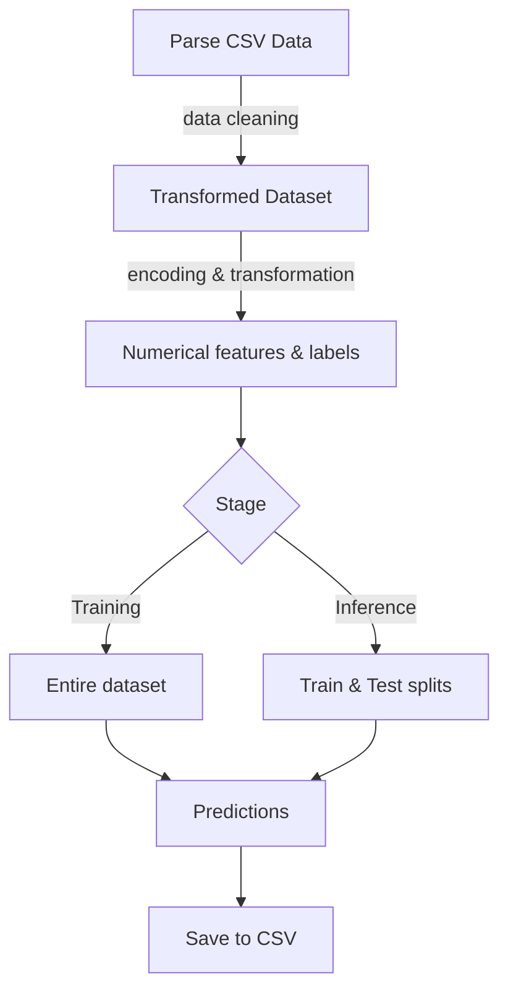

# Generic deployable XGBoost predictor

## Description

This little toy project is intended to expose a simple yet effective
model through a FastAPI endpoint, as well as deploy the model via Docker.

The models implemented are listed in an Enum class under `app/utils/utils_classifier.py`,
but can be extended with the corresponding changes in `app/model.py`.

### Implementation details

#### Data

The data can be found in [Kaggle](https://www.kaggle.com/datasets/purumalgi/music-genre-classification/data)
and can be retrieved through the Kaggle API:
```shell
cd data/raw && kaggle datasets download -d purumalgi/music-genre-classification
```

#### Model(s)
The main model used is an XGBoost classifier with the DART booster. Other 
implementations such as a Multiclass SVM and an MLP classifier are implemented
and briefly tested. 

#### Logic



#### Service Endpoints
* `/`: Get the Service Status.
* `/train_predict`: Preprocess the data, train the model and retrieve the predictions.
* `/predict`: Load a pretrained model and preprocessor, retrieve predictions.

## How to use
The model can be trained and used for inference as a service accessible on `localhost:8000` or
via Docker.

It must be noted that the produced CSV as per the requirements is by default 
saved under `data/raw/train.csv`.


### As a service
```shell
python -m virtualenv venv
source venv/bin/activate
pip install -r requirements.txt

python main.py
```
The service will be accessible via http://127.0.0.1:8000.
### Docker
The model can also be deployed on Docker:

```shell
docker build -t toy_class_predictor .
docker run -d --name toy_class_predictor_container -p 8000:8000 -v ./data:/dockerized_model/data toy_class_predictor # mount the data folder to have direct access to the output file
```

Again, the service listens to http://127.0.0.1:8000.

#### Testing

To train and retrieve the predictions for the first time, use a payload such:
```shell
curl --location 'http://127.0.0.1:8000/train_predict' --header 'Content-Type: application/json' --data '{
    "csv_train": "data/raw/train.csv", "label_col_name": "Class"
}'

```

After the model has been trained, the endpoint `predict` can be used to perform the same operation
on other datasets:
```shell
curl --location 'http://127.0.0.1:8000/predict' \
--header 'Content-Type: application/json' \
--data '{
    "csv_path": "data/raw/data.csv",
    "pretrained_model_path": "model_XGBOOST.joblib"
}'
```

**NOTE**: If the endpoint `predict` is called with an untrained model, an exception will be raised.

## NOTES
If you want to read the CSV from e.g. MS Excel, use comma and ^ as delimiters.
I added the `escapechar="^"` parameter to the stage saving the final CSV, as it
could not be parsed by Excel otherwise.
